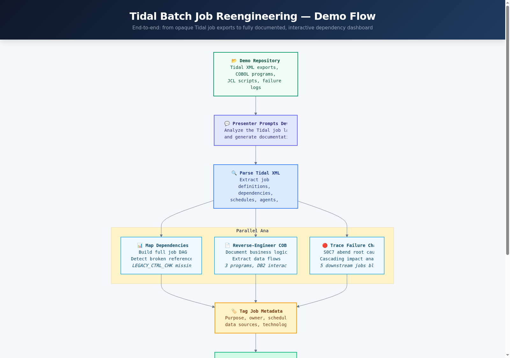

# Tidal Batch Job Reengineering Demo

AI agent reverse-engineers Tidal Workload Automation batch job workflows, maps dependencies, traces failures, and generates an interactive documentation dashboard.



[View interactive flowchart](docs/flowchart.html)

## What This Demo Shows

An enterprise's Tidal server is a black box — 20 interconnected batch jobs spanning COBOL programs, JCL scripts, shell scripts, and stored procedures run every night, but nobody fully understands the dependency chains, data flows, failure modes, or business purpose of each job. Some jobs have cryptic names (`JOB_X47B`, `PROC_LEGACY_01`) with no documentation, broken dependency references, and owners who left the company years ago. A recent overnight failure cascaded across the entire chain, blocking the regulatory compliance feed and triggering an SLA breach.

## What Devin Does Live

Devin analyzes all Tidal job definition XMLs, reverse-engineers the COBOL programs and JCL scripts, maps the full dependency graph, traces the failure log to identify root cause (an S0C7 data exception in the reconciliation step caused by a corrupted upstream record), tags each job with metadata (purpose, owner, dependencies, data sources, schedule), and generates an interactive HTML dashboard showing the complete job landscape — dependency graph, documentation cards, and failure trace visualization. The presenter opens the generated dashboard in the browser to show the audience the full picture.

## How the Demo Runs

**Trigger:** Open a Devin session on this repo and prompt Devin to analyze the Tidal job landscape and generate documentation.

Devin reads all files in `tidal_jobs/`, `cobol_programs/`, `jcl_scripts/`, `shell_scripts/`, `sql_procedures/`, and `logs/`. It then:
1. Parses the Tidal XML job definitions (authentic TES REST API format with `tes:` namespace)
2. Maps the full dependency graph across all 20 jobs and 4 job groups
3. Reverse-engineers the 3 COBOL programs to document their business logic
4. Analyzes the failure log to trace the cascading failure chain
5. Identifies broken references (deleted job `LEGACY_CTRL_CHK`, undocumented jobs)
6. Generates `dashboard/index.html` — an interactive dashboard with Mermaid dependency graph, job cards, and failure trace
7. Opens the dashboard in the browser for the audience to see

**Local development:** To view the placeholder dashboard locally, open `dashboard/index.html` in a browser. The flowchart can be viewed at `docs/flowchart.html`.

## Repo Layout

```
tidal-batch-reengineering-demo/
├── tidal_jobs/                         # Tidal Workload Automation job definitions
│   ├── finance_daily_batch.xml         #   7 finance/accounting jobs
│   ├── payroll_processing.xml          #   4 payroll jobs
│   ├── eod_operations.xml              #   5 end-of-day jobs (incl. JOB_X47B)
│   ├── legacy_misc.xml                 #   4 legacy/undocumented jobs
│   ├── groups/job_groups.xml           #   Job group hierarchy
│   └── schedules/daily_calendar.xml    #   Calendar/schedule definitions
├── cobol_programs/                     # COBOL source programs
│   ├── ACCTEXTRACT.cbl                 #   Daily account transaction extract
│   ├── GLPOSTING.cbl                   #   General ledger posting
│   └── PAYROLLCALC.cbl                #   Payroll calculation
├── jcl_scripts/                        # z/OS JCL
│   ├── ACCTEXTR.jcl                    #   Account extract JCL
│   ├── GLPOST.jcl                      #   GL posting JCL
│   └── EODRECON.jcl                    #   EOD reconciliation JCL
├── shell_scripts/                      # Unix shell scripts
│   ├── file_transfer.sh                #   SFTP file transfer
│   ├── archive_logs.sh                 #   Log archival (SOX compliance)
│   └── notify_ops.sh                   #   Operations notification
├── sql_procedures/                     # DB2 stored procedures
│   ├── sp_gl_validation.sql            #   GL validation
│   └── sp_payroll_summary.sql          #   Payroll summary
├── logs/
│   └── failure_log_20260415.log        #   Sample failure with cascading impact
├── dashboard/
│   └── index.html                      #   Scaffold — Devin generates this live
├── docs/
│   ├── flowchart.html                  #   Demo flow diagram
│   ├── flowchart.png                   #   Rasterized flowchart
│   └── IMPLEMENTATION_PLAN.md          #   Scaffold plan and research
├── DEMO_NOTES.md                       #   Presenter cheat sheet
└── .github/workflows/ci.yml           #   CI: XML validation + structure check
```

## Key Concepts

| Term | Description |
|---|---|
| **Tidal Workload Automation** | Enterprise job scheduling platform (formerly Cisco Tidal Enterprise Scheduler). Uses XML job definitions with `tes:` namespace. |
| **Job Group** | Hierarchical container for related jobs (e.g., `FINANCE_DAILY`, `EOD_NIGHTLY`). Children can inherit agent, calendar, and options. |
| **OSJob** | Operating system job — executes a command on a Tidal agent (z/OS, Unix, Windows). |
| **FTPJob** | File transfer job — SFTP/FTP between systems. |
| **ServiceJob** | Calls an external service or stored procedure. |
| **S0C7 Abend** | z/OS system abend: Data Exception. Occurs when packed decimal arithmetic encounters invalid data. |
| **Job Dependency** | A predecessor relationship — job B waits for job A to complete normally before launching. |
| **Calendar** | Schedule definition controlling which days a job runs (weekdays, biweekly, etc.). |
| **Cascading Failure** | When a job fails, all dependent downstream jobs are automatically cancelled. |
| **SOX Compliance** | Sarbanes-Oxley Act requirements for financial data audit trails and retention. |
