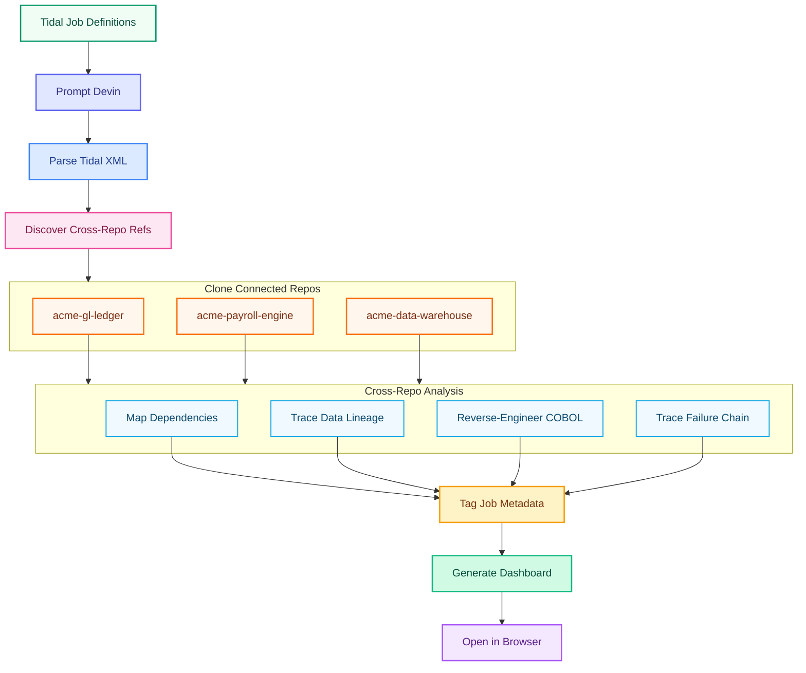

# Tidal Batch Job Reengineering Demo

AI agent reverse-engineers Tidal Workload Automation batch job workflows, maps dependencies, traces failures, and generates an interactive documentation dashboard.

[](docs/flowchart.html)

<details>
<summary>View inline flowchart</summary>



</details>

[View interactive flowchart (HTML)](docs/flowchart.html)

## What This Demo Shows

An enterprise's Tidal server is a black box — 20 interconnected batch jobs spanning COBOL programs, JCL scripts, shell scripts, and stored procedures run every night, but nobody fully understands the dependency chains, data flows, failure modes, or business purpose of each job. The jobs interact with 3 separate application codebases (GL ledger, payroll engine, data warehouse) spread across different repos — making the full picture even harder to trace manually. Some jobs have cryptic names (`JOB_X47B`, `PROC_LEGACY_01`) with no documentation, broken dependency references, and owners who left the company years ago. A recent overnight failure cascaded across the entire chain, blocking the regulatory compliance feed and triggering an SLA breach.

## Connected Application Repos

The Tidal batch jobs don't exist in isolation — they read from and write to these downstream application systems:

| Repo | Description | Jobs That Interact |
|---|---|---|
| [`acme-gl-ledger`](https://github.com/tedfoley-cog/acme-gl-ledger) | General Ledger system — DB2 tables (GL_MASTER, GL_TRANSACTIONS, CHART_OF_ACCOUNTS), stored procedures (SP_GL_VALIDATION, SP_GL_PERIOD_CLOSE), Spring inquiry service | ACCT_DAILY_EXTRACT, ACCT_VALIDATION, GL_POSTING_BATCH, GL_REPORT_DAILY, EOD_RECONCILIATION |
| [`acme-payroll-engine`](https://github.com/tedfoley-cog/acme-payroll-engine) | Payroll processing engine — COBOL copybooks (EMPRECORD, TAXTABLE, DEDCODES), DB2 tables (EMPLOYEE_MASTER, PAY_HISTORY), Kronos integration, ACH routing config | PAYROLL_TIME_IMPORT, PAYROLL_CALC, PAYROLL_ACH_FILE, SP_PAYROLL_SUMMARY |
| [`acme-data-warehouse`](https://github.com/tedfoley-cog/acme-data-warehouse) | Enterprise data warehouse — star schema (FACT_GL_DAILY, FACT_RECONCILIATION, FACT_PAYROLL), ETL pipelines, SOX compliance feed specs, report templates | GL_REPORT_DAILY, EOD_RECONCILIATION, REGULATORY_FEED, PAYROLL_TAX_REPORT |

## What Devin Does Live

Devin analyzes all Tidal job definition XMLs, discovers cross-repo references in the job descriptions and XML comments, clones the 3 connected application repos, and maps the full dependency picture — not just the job-to-job dependencies, but the data flows through DB2 tables, COBOL copybooks, stored procedures, ETL pipelines, and compliance feeds. It reverse-engineers the COBOL programs and JCL scripts, traces the failure log to identify root cause (an S0C7 data exception caused by a corrupted upstream record), tags each job with metadata, and generates an interactive HTML dashboard showing the complete cross-repo job landscape.

## How the Demo Runs

**Trigger:** Open a Devin session on this repo and prompt Devin to analyze the Tidal job landscape, pull in the connected application repos, and generate full documentation.

Devin reads all files in `tidal_jobs/`, `cobol_programs/`, `jcl_scripts/`, `shell_scripts/`, `sql_procedures/`, and `logs/`. It discovers cross-repo references in the XML comments and job descriptions, then clones and analyzes the 3 connected repos. It then:
1. Parses the Tidal XML job definitions (authentic TES REST API format with `tes:` namespace)
2. Clones [`acme-gl-ledger`](https://github.com/tedfoley-cog/acme-gl-ledger), [`acme-payroll-engine`](https://github.com/tedfoley-cog/acme-payroll-engine), and [`acme-data-warehouse`](https://github.com/tedfoley-cog/acme-data-warehouse) to trace data flows
3. Maps the full dependency graph across all 20 jobs, 4 job groups, and 3 application repos
4. Traces data lineage: which DB2 tables each job reads/writes, which copybooks the COBOL programs use, which ETL pipelines feed the warehouse
5. Reverse-engineers the 3 COBOL programs and matches them to the copybook definitions in `acme-payroll-engine`
6. Analyzes the failure log to trace the cascading failure chain
7. Identifies broken references (deleted job `LEGACY_CTRL_CHK`, undocumented jobs, orphaned ETL configs)
8. Generates `dashboard/index.html` — an interactive cross-repo dashboard with dependency graph, data flow diagram, job cards, and failure trace
9. Opens the dashboard in the browser for the audience to see

**Local development:** To view the placeholder dashboard locally, open `dashboard/index.html` in a browser. The flowchart can be viewed at `docs/flowchart.html`.

## Repo Layout

```
tidal-batch-reengineering-demo/
├── tidal_jobs/                         # Tidal Workload Automation job definitions
│   ├── finance_daily_batch.xml         #   7 finance/accounting jobs
│   ├── payroll_processing.xml          #   4 payroll jobs
│   ├── eod_operations.xml              #   5 end-of-day jobs (incl. JOB_X47B)
│   ├── legacy_misc.xml                 #   4 legacy/undocumented jobs
│   ├── groups/job_groups.xml           #   Job group hierarchy
│   └── schedules/daily_calendar.xml    #   Calendar/schedule definitions
├── cobol_programs/                     # COBOL source programs
│   ├── ACCTEXTRACT.cbl                 #   Daily account transaction extract
│   ├── GLPOSTING.cbl                   #   General ledger posting
│   └── PAYROLLCALC.cbl                #   Payroll calculation
├── jcl_scripts/                        # z/OS JCL
│   ├── ACCTEXTR.jcl                    #   Account extract JCL
│   ├── GLPOST.jcl                      #   GL posting JCL
│   └── EODRECON.jcl                    #   EOD reconciliation JCL
├── shell_scripts/                      # Unix shell scripts
│   ├── file_transfer.sh                #   SFTP file transfer
│   ├── archive_logs.sh                 #   Log archival (SOX compliance)
│   └── notify_ops.sh                   #   Operations notification
├── sql_procedures/                     # DB2 stored procedures
│   ├── sp_gl_validation.sql            #   GL validation
│   └── sp_payroll_summary.sql          #   Payroll summary
├── logs/
│   └── failure_log_20260415.log        #   Sample failure with cascading impact
├── dashboard/
│   └── index.html                      #   Scaffold — Devin generates this live
├── docs/
│   ├── flowchart.html                  #   Demo flow diagram
│   ├── flowchart.png                   #   Rasterized flowchart
│   └── IMPLEMENTATION_PLAN.md          #   Scaffold plan and research
├── DEMO_NOTES.md                       #   Presenter cheat sheet
└── .github/workflows/ci.yml           #   CI: XML validation + structure check
```

## Key Concepts

| Term | Description |
|---|---|
| **Tidal Workload Automation** | Enterprise job scheduling platform (formerly Cisco Tidal Enterprise Scheduler). Uses XML job definitions with `tes:` namespace. |
| **Job Group** | Hierarchical container for related jobs (e.g., `FINANCE_DAILY`, `EOD_NIGHTLY`). Children can inherit agent, calendar, and options. |
| **OSJob** | Operating system job — executes a command on a Tidal agent (z/OS, Unix, Windows). |
| **FTPJob** | File transfer job — SFTP/FTP between systems. |
| **ServiceJob** | Calls an external service or stored procedure. |
| **S0C7 Abend** | z/OS system abend: Data Exception. Occurs when packed decimal arithmetic encounters invalid data. |
| **Job Dependency** | A predecessor relationship — job B waits for job A to complete normally before launching. |
| **Calendar** | Schedule definition controlling which days a job runs (weekdays, biweekly, etc.). |
| **Cascading Failure** | When a job fails, all dependent downstream jobs are automatically cancelled. |
| **SOX Compliance** | Sarbanes-Oxley Act requirements for financial data audit trails and retention. |
